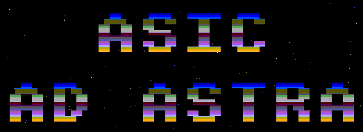

   

Credits to [Project F: Ad Astra](https://projectf.io/posts/fpga-ad-astra/).

Project was modified to fit into a 1x2 TTSKY26a shuttle.

Thanks to [IQonIC Works](https://iqonicworks.com) for hosting the Tiny Tapeout workshop at [Down Underflow 2026](https://fossi-foundation.org/downunderflow/2026).

